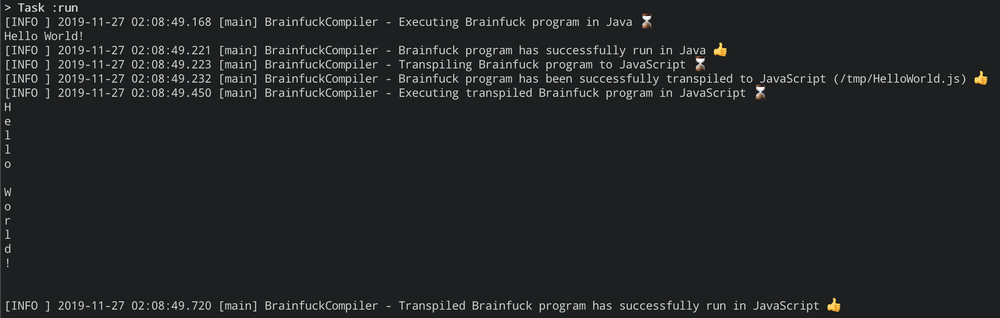

# Brainfuck to JavaScript compiler

[](https://github.com/annikulin/brainfuck-compiler/actions)

## Overview

Brainfuck compiler that can execute Brainfuck programs in Java and transpile them to JavaScript.

The following phases of the compiler are supported:
1. Lexical Analysis (Tokenization). The text of the program is broken up into `Token`s and kept inside of a computer’s memory;
1. Parsing. A sequence of `Token`s is being analyzed, and a parse model consisting of `Statement`s and `Expression`s is constructed showing syntactic relation between commands;
1. Code Optimization. Subsequent increment, decrement, and shift commands are replaced by a single aggregate operation;
1. Code Generation or Execution:
    * Code Generation. Brainfuck program is transpiled into JavaScript code;
    * Code Execution. Brainfuck program is being interpreted in Java.

## Quickstart

Use `BrainfuckCompiler` command-line utility to try out how the transpiler works. 

To execute a classic "Hello World!", create a file with Brainfuck code: 
```
echo "++++++++[>++++[>++>+++>+++>+<<<<-]>+>+>->>+[<]<-]>>.>---.+++++++..+++.>>.<-.<.+++.------.--------.>>+.>++." > /tmp/HelloWorld.b
```

Then, run the compiler with `./gradlew run` passing the arguments for inout Brainfuck program and output JS file. 
```
./gradlew run --args="-i /tmp/HelloWorld.b -o /tmp/HelloWorld.js"
```

First, `BrainfuckCompiler` executes Brainfuck code in Java, then transpiles it to JavaScript, and evaluates generated script inside the [Nashorn](https://docs.oracle.com/javase/8/docs/technotes/guides/scripting/prog_guide/api.html) JS engine.  

